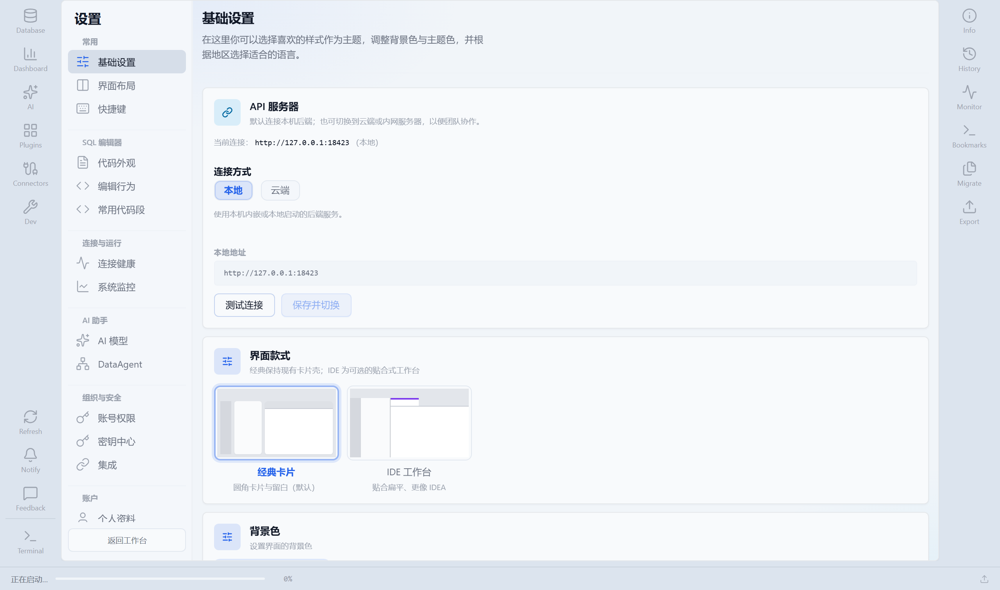
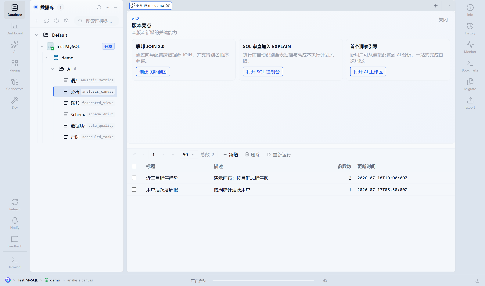

<p align="center">
  
</p>

<h1 align="center">DataWise</h1>

<p align="center">
  <b>AI 驱动的团队数据工作台。</b><br />
  探索 · 写 SQL · 治理 · 分析 — <b>数据在哪，工作台就在哪。</b>
</p>

<p align="center">
  <a href="./README.md">English</a> ·
  <a href="./README.zh-CN.md">简体中文</a>
</p>

<p align="center">
  <a href="https://github.com/gouyehappy/datawise-cli/blob/main/LICENSE"></a>
  <a href="https://github.com/gouyehappy/datawise-cli"></a>
  <a href="#快速开始"></a>
  <a href="#快速开始"></a>
  <a href="./datawise-frontend/"></a>
  <a href="./datawise-backend/"></a>
  <a href="./datawise-backend/datawise-connectors/"></a>
  <a href="https://github.com/gouyehappy/datawise-cli/stargazers"></a>
</p>

<p align="center">
  <a href="https://github.com/gouyehappy/datawise-cli/actions/workflows/backend-tests.yml"></a>
  <a href="https://github.com/gouyehappy/datawise-cli/actions/workflows/frontend-tests.yml"></a>
  <a href="./docs/user-manual/"></a>
  <a href="./sql-editor/"></a>
  <a href="./datawise-mcp/"></a>
</p>

**DataWise** 是开源的全栈数据工作台，不是简单的数据库图形客户端。连接数据库与数据湖，浏览 Schema，编写可治理的 SQL，在同一界面把问题变成洞察：提供 **Explorer**、**Monaco SQL 控制台**、**语义指标**、**联邦视图**、**团队治理** 与 **流式 AI** — 支持浏览器、桌面端（Windows / macOS / Linux），以及通过 **MCP** 接入 IDE。

---

## 一览

| 层次 | 包 / 目录 | 职责 |
|------|-----------|------|
| 客户端 | [`datawise-frontend`](./datawise-frontend/) | Explorer、工作区 Tab、AI 对话、设置、Electron 壳 |
| API | [`datawise-backend`](./datawise-backend/) | 连接、SQL 执行、AI、平台任务、团队共享 |
| 编辑器 | [`sql-editor`](./sql-editor/) | 可嵌入的 `@datawise/sql-editor`（语法补全、提示条） |
| 智能体 | [`datawise-mcp`](./datawise-mcp/) | 面向 Cursor / Claude Desktop 的 MCP 工具 |
| IDE | [`datawise-vscode`](./datawise-vscode/) | 将选区打开到桌面版 SQL 控制台 |
| 自动化 | [`headless-cli`](./headless-cli/) | 迁移、SQL 执行、Query Library CI、配置迁移 |
| 配置 | [`config/`](./config/) | 本机连接、插件、驱动、密钥（**不入库**） |

**开发端口：** 前端 `28413` · 后端 `18421` · 桌面内嵌后端 `18423`

---

## 能做什么

### 数据与 SQL

- 统一 **Explorer**：连接、库表、视图、脚本；Redis / Kafka / YARN / SSH 工作台
- **SQL 控制台**：Monaco 编辑、结果网格、执行计划、会话/事务、历史与书签、可视化查询构建
- 自研 **SQL 编辑器**：方言补全、代码片段、外键 JOIN、格式化
- Schema 对比、表迁移、CSV 导入导出、跨环境抽样

### AI 与语义层

- 选表上下文的 **AI 对话**、Text-to-SQL、流式分析、报告与画布
- 按库维护 **语义指标** 目录（可从 Schema 生成）
- 知识库 / RAG 接入业务语境

### 团队与治理

- 共享连接，支持 **只读 / 读写 / DDL** 权限级别
- Query Library、生产 **审批**、危险写操作执行前审查
- 团队审计、共享查询、环境标签（开发 / 预发 / 生产）

### 平台能力

- 联邦虚拟视图、定时任务、Schema 漂移监控、数据质量
- 插件中心按需启用 Explorer / AI / 导出等能力
- 从 `config/plugins/` 热加载 Connector JAR（仓库内约 **37** 个数据源插件）

### 使用方式

| 方式 | 适用场景 |
|------|----------|
| **Web** | 本地后端 + Vite（`npm run dev`） |
| **桌面** | Electron 一体化包（`npm run dist:desktop`，Win / Mac / Linux） |
| **IDE 智能体** | [`datawise-mcp`](./datawise-mcp/) |
| **VS Code** | [`datawise-vscode`](./datawise-vscode/) Deep Link 打开桌面版 |
| **CI / 无头** | [`headless-cli`](./headless-cli/) |

---

## 预览

由 Vue 客户端自动截图（Mock API）。重新生成：

```bash
npm run capture:demos --prefix datawise-frontend
```

使用说明书：[docs/user-manual/](./docs/user-manual/) · 截图清单：[MANIFEST.md](./docs/assets/screenshots/MANIFEST.md)

| 仪表盘 | Explorer | SQL 控制台 |
|:---:|:---:|:---:|
|  |  |  |

| AI 分析 | 设置 | 分析画布 |
|:---:|:---:|:---:|
|  |  |  |

**SQL 编辑器**（[`@datawise/sql-editor`](./sql-editor/)）— 语法补全、Schema 提示、JOIN 片段：


---

## 架构

```
┌──────────────────────────────────────────────────────────┐
│  datawise-frontend (Vue 3 · Pinia · Vite · Electron)      │
│  Explorer · 工作区 · AI · 设置 · 仪表盘                    │
└────────────────────────────┬─────────────────────────────┘
                             │ REST / SSE
┌────────────────────────────▼─────────────────────────────┐
│  datawise-server (Spring Boot 3 · Java 17)                │
│  database · workspace · ai · platform · connectors        │
└────────────────────────────┬─────────────────────────────┘
                             │ JDBC / 插件 SPI
┌────────────────────────────▼─────────────────────────────┐
│  config/plugins/*.jar  +  config/drivers/*.jar            │
└────────────────────────────┬─────────────────────────────┘
                             │
         datawise-mcp/ ──────┴──────► IDE 智能体（Cursor、Claude）
         sql-editor/   ─────────────► 可嵌入包（MIT，Monorepo 内以源码引用）
```

运行时状态保存在本机 `config/`。前端通过 Vite 别名以 **TypeScript 源码** 引用 `@datawise/sql-editor`，无需单独执行编辑器库的 build。

---

## 快速开始

**环境要求：** Node 18+、JDK 17+、Maven 3.9+

```bash
# 1. 后端 API
cd datawise-backend
mvn spring-boot:run -pl datawise-server -am
# → http://localhost:18421  (GET /api/health)

# 2. 前端（sql-editor 经 file: 依赖自动接入）
cd ../datawise-frontend
cp .env.development.example .env.development   # 首次
npm install && npm run dev
# → http://localhost:28413
```

也可在前端目录一键起前后端：`npm run dev:all`（见 [scripts/README.md](./scripts/README.md)）。

**首次配置**

```bash
cp config/connections.xml.example config/connections.xml
cp config/users.json.example config/users.json
```

将 Connector JAR 放入 `config/plugins/`，JDBC 驱动放入 `config/drivers/`。详见 [config/README.md](./config/README.md) 与 [docs/README.md](./docs/README.md)。

**桌面版**

```bash
cd datawise-frontend
npm run dist:desktop        # 当前系统（Windows 默认 NSIS / 便携）
npm run dist:desktop:mac    # Apple Silicon，须在 macOS 上执行
npm run dist:desktop:linux  # AppImage
# 产物 → release/
```

**Query Library CI**（校验无需启动服务）：

```bash
cd headless-cli && npm install && npm run build
node dist/main.js query-library validate -m ../examples/query-library/query-library.json
```

说明见 [examples/query-library/README.md](./examples/query-library/README.md)。

---

## 仓库结构

| 目录 | 说明 |
|------|------|
| [datawise-frontend/](./datawise-frontend/) | Vue 3 客户端与 Electron 打包 |
| [datawise-backend/](./datawise-backend/) | Spring Boot API（多模块） |
| [sql-editor/](./sql-editor/) | 可嵌入 SQL 编辑器（MIT） |
| [datawise-mcp/](./datawise-mcp/) | IDE 智能体 MCP 服务 |
| [datawise-vscode/](./datawise-vscode/) | VS Code 扩展（Deep Link） |
| [headless-cli/](./headless-cli/) | 命令行：SQL、迁移、CI、配置迁移 |
| [config/](./config/) | 本地运行时配置（仓库仅 example） |
| [docs/](./docs/) | 联调、连接器、插件、部署 |
| [docs/user-manual/](./docs/user-manual/) | **中文使用说明书**（分章 + 截图） |

后端入口：`datawise-server`。连接器实现：`datawise-backend/datawise-connectors/`。

---

## 开发与提交

```bash
# 提交前检查
node scripts/pre-commit-check.mjs

# 前端
cd datawise-frontend && npm run typecheck && npm run test

# 后端
cd datawise-backend && mvn test

# SQL 编辑器
cd sql-editor && npm run typecheck && npm test
```

**切勿提交：** `config/connections.xml`、`config/users/*/app.xml`、含密钥的 `.env`、`config/` 下运行时 JSON/XML。

---

## 许可

- 主仓库：[Apache License 2.0](./LICENSE)
- SQL 编辑器（`sql-editor/`）：MIT — 见 [NOTICE](./NOTICE)

欢迎提交 Issue 与 Pull Request。
