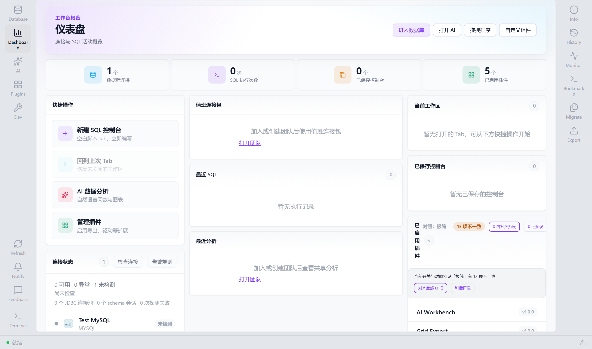
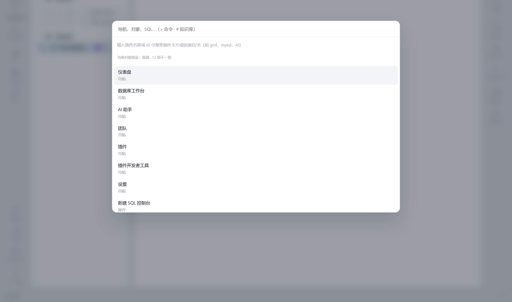
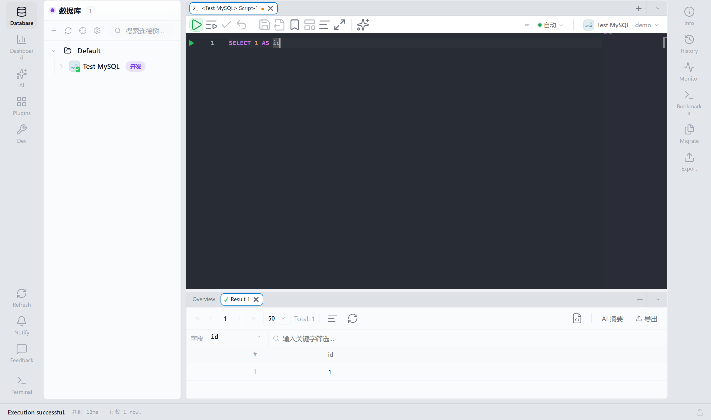
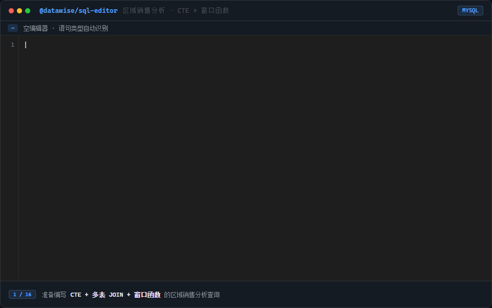

# DataWise

[English](./README.md)

**开源多数据源数据库工作台** — 一个仓库里集齐 Explorer、SQL 控制台、表迁移、AI 分析与桌面客户端。

浏览器开发调试，Electron 一键打包成「内嵌后端 + JRE」的桌面应用；连接器以插件 JAR 热插拔，SQL 编辑器可独立嵌入你的项目。

---

## 预览

### 工作台

由 Vue 客户端自动截图（Mock API）。重新生成：`npm run capture:demos --prefix datawise-frontend`。

| | | |
|:---:|:---:|:---:|
| **仪表盘** | **Explorer** | **SQL 控制台** |
|  |  |  |
| **AI 分析** | | |
|  | | |

### SQL 编辑器（[`@datawise/sql-editor`](./sql-editor/)）

语法驱动补全、Schema 感知、外键 JOIN 一行生成：



> 克隆仓库后按下方「快速开始」在浏览器或 Windows 桌面版本地运行完整工作台。

---

## 亮点

| | |
|---|---|
| **30+ 数据源** | MySQL、PostgreSQL、Oracle、ClickHouse、Hive、Redis、Kafka、Elasticsearch、Doris、OceanBase … 统一 Explorer 与 SQL 入口 |
| **自研 SQL 编辑器** | 可单独 `npm install` 嵌入任意 Vue 3 应用；Monorepo 内与主产品同源迭代 |
| **AI 工作台** | 对话式分析、Text-to-SQL、流式执行计划、知识库词条；生成 SQL 可一键落到控制台 |
| **表迁移** | 跨库表结构 + 数据迁移向导，支持大批量与断点续传 |
| **插件化架构** | 后端 Connector SPI + 前端功能插件中心，按需开关 AI、书签、监控等能力 |
| **三种使用方式** | Web 联调 · Windows 桌面一体化包 · [VS Code 扩展](./datawise-vscode/) / [Headless CLI](./headless-cli/) |

---

## 你能做什么

- **浏览 Schema** — 连接树懒加载、统一命令面板（`Ctrl+K`）、表数据编辑、DDL 查看  
- **写 SQL** — Monaco 多 Tab 控制台、执行计划、会话/事务、书签与历史  
- **管数据** — 表迁移、Schema 对比、跨环境抽样对比、CSV 导入导出  
- **用 AI** — 选库表上下文提问，分析结果带 SQL 与图表，可回流到工作台  
- **上生产** — 团队共享连接、审批流、环境标签；按数据源能力控制 EXPLAIN / 杀会话等  

---

## 架构

```
┌─────────────────────────────────────────────────────────┐
│  datawise-frontend (Vue 3 · Electron)                   │
│  Explorer · Workspace · AI · Dashboard · Plugin Center  │
└──────────────────────────┬──────────────────────────────┘
                           │ REST / SSE
┌──────────────────────────▼──────────────────────────────┐
│  datawise-server (Spring Boot)                          │
│  database · workspace · ai · connectors                 │
└──────────────────────────┬──────────────────────────────┘
                           │ JDBC / 插件 SPI
┌──────────────────────────▼──────────────────────────────┐
│  config/plugins/*.jar  +  config/drivers/*.jar            │
│  MySQL · PG · Redis · Kafka · …                         │
└─────────────────────────────────────────────────────────┘

sql-editor/  ──►  独立 npm 包，grammar 补全引擎
```

Monorepo，前后端与编辑器同源维护；本地配置集中在 `config/`（连接、插件、密钥不入库）。

---

## 快速开始

**环境**：Node 18+、JDK 17+、Maven 3.9+

```bash
# 1. 后端 API
cd datawise-backend
mvn spring-boot:run -pl datawise-server -am
# → http://localhost:18421  (GET /api/health)

# 2. SQL 编辑器（首次克隆需要 build 一次）
cd ../sql-editor && npm install && npm run build

# 3. 前端
cd ../datawise-frontend
cp .env.development.example .env.development   # 首次
npm install && npm run dev
# → http://localhost:28413
```

首次使用请在 `config/` 配置连接（参考 `config/connections.xml.example`）并将所需 connector JAR 放入 `config/plugins/`。  
更多说明见 [docs/README.md](./docs/README.md)。

**桌面版（Windows）**：

```bash
cd datawise-frontend
npm run dist:desktop    # 需要 JAVA_HOME + Maven，产物在 release/
```

---

## 仓库结构

| 目录 | 说明 |
|------|------|
| [datawise-frontend/](./datawise-frontend/) | Vue 3 客户端与 Electron 打包 |
| [datawise-backend/](./datawise-backend/) | Spring Boot API 与 Connector 实现 |
| [sql-editor/](./sql-editor/) | 可嵌入 SQL 编辑器（MIT） |
| [datawise-vscode/](./datawise-vscode/) | VS Code → 桌面端 Deep Link |
| [headless-cli/](./headless-cli/) | 命令行调用迁移与 SQL 执行 |
| [docs/](./docs/) | 联调、配置与插件说明 |

---

## 技术栈

Vue 3 · Pinia · Vite · Monaco · Electron · Spring Boot 3 · JDBC · Spring AI

---

## 参与与许可

欢迎 Issue 与 PR。提交前可运行：

```bash
node scripts/pre-commit-check.mjs
cd datawise-frontend && npm run typecheck && npm run test
cd datawise-backend && mvn test
```

- 主项目：[Apache License 2.0](./LICENSE)  
- SQL 编辑器：MIT（见 [NOTICE](./NOTICE)）
