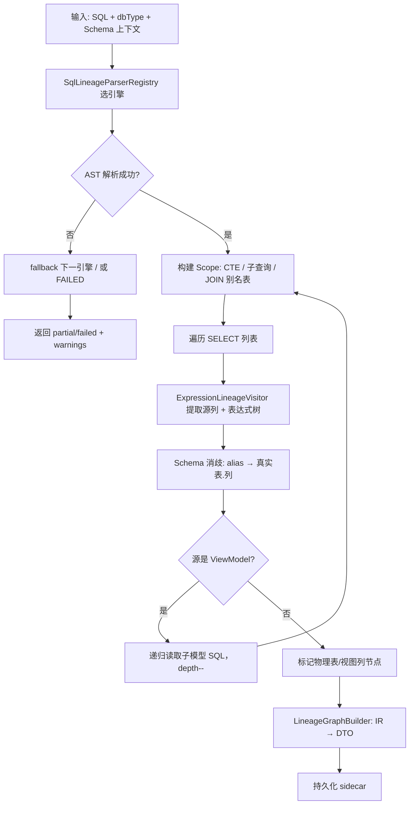

# ViewModel 字段级血缘 — 详细设计方案

> **版本**：v2  
> **状态**：待评审  
> **适用对象**：ViewModel（`.view.sql`）  
> **解析引擎**：Phase 1 JSQLParser · 预留 Calcite / dt-sql-parser 扩展口

---

## 一、背景与目标

### 1.1 业务诉求

用户在 Explorer 中创建/编辑 **ViewModel（模型，`.view.sql`）** 后，需要：

1. 右键模型 → **「血缘」** 菜单
2. 以**有向图**展示**字段级**上下游关系
3. 多字段合成一字段时，展示**变换函数/表达式**（如 `CONCAT(a,b)`、`ROUND(SUM(amount),2)`）
4. **实时解析**：保存或打开血缘时即时解析，无需离线批处理平台

### 1.2 与现有系统的关系

| 已有能力 | 现状 | 本功能关系 |
|---------|------|-----------|
| ViewModel | 单条 SELECT，存于 `view-models/*.view.sql` | **核心解析对象** |
| 指标血缘 (#18) | 手工填写 `upstreamMetrics` | Phase 2 可打通；本方案先做 **SQL 自动解析** |
| Schema ER 图 | SVG 自研图（`SchemaErGraphPanel.vue`） | **复用图渲染基础设施** |
| 前端 SQL 解析 | `dt-sql-parser`（ANTLR，多方言） | 编辑器内**草稿预览**（非权威） |
| 后端 SQL 解析 | `SqlSelectDetector` 正则 | **新增 AST 级血缘解析** |
| 类型解析 SPI | `LogicalTypeParser` + Registry | **血缘解析 SPI 对齐此模式** |

当前 `view_model` 右键菜单（`datawise-frontend/src/features/explorer/constants/context-menus.ts`）尚无血缘项，需扩展。

### 1.3 设计原则

1. **解析引擎可替换**：业务层不依赖 JSQLParser / Calcite 具体 AST
2. **分阶段交付**：Phase 1 用 JSQLParser 快速 MVP；Calcite 作为可选模块后期接入
3. **方言诚实降级**：不承诺「全方言 100% 覆盖」，用 `complete / partial / failed` 明确告知
4. **最小侵入**：复用现有 Explorer 菜单、Workspace Tab、Schema ER 图组件

---

## 二、范围定义

### 2.1 Phase 1（MVP，4~5 周）

| 维度 | 范围 |
|------|------|
| 对象 | 单连接内 ViewModel（`.view.sql`） |
| SQL | `SELECT` / `WITH ... SELECT` |
| 粒度 | 输出列 → 源列（含表达式中间节点） |
| 源 | 物理表、视图、同库其他 ViewModel（递归，默认 depth=3） |
| 方言 | **MySQL 族、PostgreSQL 族**（JSQLParser 主力） |
| UI | Explorer 右键 → 血缘 Tab → SVG 图 |

### 2.2 Phase 2（3 周）

- UNION ALL、窗口函数
- 联邦视图（`@alias` + JOIN）
- 编辑器内 debounce 草稿预览
- dt-sql-parser sidecar（Flink / Hive / Spark / Trino 补充路径）
- 下游影响分析 + 变更告警（复用 #18 通知）

### 2.3 Phase 3（按需）

- **Calcite 可选模块**接入（Flink / Hive 等复杂方言）
- 跨连接血缘
- 与语义指标 `upstreamMetrics` 自动关联

### 2.4 明确不做（初期）

- DML / ETL 管道血缘
- 存储过程 / 触发器
- 100% 全方言覆盖

---

## 三、解析引擎架构（核心）

### 3.1 三层分离

```
┌──────────────────────────────────────────────────────────┐
│  LineageService（业务层 — 稳定，不随引擎更换而改）          │
│  · ViewModel save hook                                   │
│  · 递归展开子模型                                         │
│  · sidecar 持久化                                         │
│  · IR → LineageGraphDto                                  │
├──────────────────────────────────────────────────────────┤
│  Lineage IR（中间表示 — 稳定）                            │
│  · ColumnLineage / ExpressionNode / SourceRef            │
├──────────────────────────────────────────────────────────┤
│  SqlLineageParser SPI（解析层 — 可替换/可扩展）            │
│  · JsqlLineageParser        ← Phase 1 默认               │
│  · DtSqlParserLineageAdapter ← Phase 2 可选 sidecar      │
│  · CalciteLineageParser     ← Phase 3 可选模块（stub 先留）│
└──────────────────────────────────────────────────────────┘
```

**关键约束：JSQLParser / Calcite 的 AST 类型不得泄漏到 `service/`、`api/`、`model/` 包。**

### 3.2 SPI 接口设计

对齐现有 `LogicalTypeParser` + `LogicalTypeParserRegistry` 模式：

```java
/** SQL → 血缘 IR，与具体 AST 引擎无关 */
public interface SqlLineageParser {

    /** 是否支持该 dbType（mysql、postgresql、flink …） */
    boolean supports(String dbType);

    /** 数值越小优先级越高 */
    default int priority() { return 100; }

    /** 引擎标识，写入 meta.parser */
    String engineId();  // "jsqlparser" | "calcite" | "dt-sql-parser"

    /** 解析 SQL → 引擎无关 IR */
    LineageParseResult parse(LineageParseRequest request);
}
```

```java
public record LineageParseRequest(
    String sql,
    String dbType,
    String connectionId,
    String instanceName,
    String database,
    SchemaCatalog schema,       // 列消歧（来自 ExplorerSchemaService）
    int maxDepth,
    Set<String> visitedModels   // 防环
) {}

public record LineageParseResult(
    List<ColumnLineage> columns,
    List<LineageWarning> warnings,
    ParseStatus status,         // COMPLETE | PARTIAL | FAILED
    String engineId,
    String engineVersion
) {}
```

### 3.3 注册表与 Fallback 链

```java
@Component
public class SqlLineageParserRegistry {

    /** 按 dbType 选最优 parser */
    public SqlLineageParser require(String dbType) { ... }

    /** 主解析失败时按 priority 依次 fallback */
    public LineageParseResult parseWithFallback(LineageParseRequest req) {
        return parsers.stream()
            .filter(p -> p.supports(req.dbType()))
            .sorted(Comparator.comparingInt(SqlLineageParser::priority))
            .map(p -> tryParse(p, req))
            .filter(r -> r.status() != ParseStatus.FAILED)
            .findFirst()
            .orElse(LineageParseResult.failed(...));
    }
}
```

### 3.4 方言路由策略

| dbType 族 | Phase 1 引擎 | Phase 2 | Phase 3 |
|-----------|-------------|---------|---------|
| MySQL / MariaDB / TiDB | JSQLParser | 同左 | 可选 Calcite fallback |
| PostgreSQL / Kingbase / OpenGauss | JSQLParser | 同左 | 可选 Calcite fallback |
| Oracle / SQL Server / DB2 | JSQLParser（partial） | 增强 | Calcite |
| Hive / Spark | **不支持** → failed/partial | dt-sql-parser sidecar | Calcite |
| Flink / Trino / Presto | **不支持** → failed/partial | dt-sql-parser sidecar | Calcite |
| ClickHouse / Doris / StarRocks | partial（简单 SELECT） | dt-sql-parser | Calcite |

配置示例（`application.yml`）：

```yaml
lineage:
  max-depth: 3
  calcite:
    enabled: false              # Phase 3 才开启
  parser:
    routing:
      mysql: jsqlparser
      postgresql: jsqlparser
      flink: calcite            # enabled=false 时走 fallback
      hive: calcite
    fallback-chain:
      - jsqlparser
      - dt-sql-parser
      - calcite
```

### 3.5 引擎选型结论

| 引擎 | 角色 | 说明 |
|------|------|------|
| **JSQLParser** | Phase 1 默认 | Java 原生、轻量，适合 RDBMS SELECT 血缘 |
| **dt-sql-parser** | Phase 2 补充 | 项目已有（前端），可通过 Node sidecar 服务 OLAP 方言 |
| **Calcite** | Phase 3 可选 | 语义分析强、依赖重；**独立 Maven 模块，默认不打包** |
| 自研 ANTLR | ❌ 不做 | dt-sql-parser 已是 ANTLR 方案，重复建设 |
| sqllineage / sqlglot | ❌ 不做 | Python 栈割裂 |

**JSQLParser 不能适应所有方言**（Flink 窗口 TVF、`MATCH_RECOGNIZE`、Hive `LATERAL VIEW` 等会失败），必须通过 SPI + 降级策略诚实处理。

---

## 四、数据模型

### 4.1 引擎无关 IR（后端内部，稳定契约）

```java
/** 单列血缘 */
record ColumnLineage(
    String outputColumn,              // 输出列名/alias
    List<SourceRef> sources,          // 叶子源列（展开后）
    ExpressionNode expressionTree     // null = 直通
) {}

/** 源列引用 */
record SourceRef(
    String connectionId,
    String database,
    String schema,
    String table,
    String column,
    String tableAlias,
    SourceKind kind                   // PHYSICAL_TABLE | VIEW | VIEW_MODEL
) {}

/** 表达式树（引擎无关） */
sealed interface ExpressionNode {
    record ColumnRef(SourceRef ref) implements ExpressionNode {}
    record Function(String name, List<ExpressionNode> args) implements ExpressionNode {}
    record Binary(String operator, ExpressionNode left, ExpressionNode right) implements ExpressionNode {}
    record Literal(String value, String type) implements ExpressionNode {}
    record CaseExpr(List<WhenThen> whens, ExpressionNode elseExpr) implements ExpressionNode {}
    record Subquery(String sql, List<ColumnLineage> inner) implements ExpressionNode {}
    record Cast(ExpressionNode inner, String targetType) implements ExpressionNode {}
}
```

### 4.2 API DTO（前后端共享，`datawise-common`）

```typescript
interface LineageGraphDto {
  root: LineageNodeRef
  nodes: LineageNodeDto[]
  edges: LineageEdgeDto[]
  meta: LineageMetaDto
}

interface LineageNodeDto {
  id: string
  kind: 'model' | 'table' | 'column' | 'expression'
  label: string
  qualifiedName?: string          // db.schema.table.column
  dataType?: string
  expression?: string             // CONCAT(a, '-', b)
  expressionKind?: 'function' | 'operator' | 'literal' | 'case' | 'subquery' | 'cast'
}

interface LineageEdgeDto {
  id: string
  from: string
  to: string
  role: 'direct' | 'transform'
  label?: string                  // SUM, CONCAT, +
}

interface LineageMetaDto {
  sqlHash: string                 // SHA-256(normalizedSql)
  parsedAt: string
  dialect: string
  parser: string                  // jsqlparser | calcite | dt-sql-parser
  parserVersion: string
  depth: number
  status: 'complete' | 'partial' | 'failed'
  warnings: LineageWarning[]
}

interface LineageWarning {
  code: 'UNRESOLVED_COLUMN' | 'AMBIGUOUS_TABLE' | 'UNSUPPORTED_SYNTAX'
      | 'CIRCULAR_REF' | 'UNSUPPORTED_DIALECT' | 'PARSER_FAILED'
  message: string
  location?: { line?: number; column?: number }
}
```

### 4.3 持久化

与 ViewModel 同目录 sidecar 文件：

```
workspace/{connectionId}/{instance}/view-models/
  orders_summary.view.sql
  orders_summary.view.sql.lineage.json    ← 解析缓存
```

**触发时机：**

| 事件 | 动作 |
|------|------|
| `ViewModelFileService.save()` 成功 | 同步解析 + 写 sidecar（失败不阻断保存） |
| `saveDraft()` | 可选解析，meta 标记 `draft` |
| 打开血缘 Tab | 读 sidecar；`sqlHash` 不一致则重算 |
| Schema 变更 | 标记 stale，下次打开重算 |

---

## 五、解析算法

### 5.1 总体流程



### 5.2 典型 SQL 解析示例

```sql
SELECT
  o.id AS order_id,
  CONCAT(u.first_name, ' ', u.last_name) AS full_name,
  ROUND(SUM(oi.amount), 2) AS total_amount,
  CASE WHEN o.status = 1 THEN 'paid' ELSE 'pending' END AS status_label
FROM orders o
JOIN users u ON o.user_id = u.id
JOIN order_items oi ON oi.order_id = o.id
GROUP BY o.id, u.first_name, u.last_name, o.status
```

图结构：

```
orders.id ──────────────────────────────► order_id
users.first_name ──┐
                   ├─ [CONCAT(·,' ',·)] ──► full_name
users.last_name ───┘
order_items.amount ── [SUM(·)] ── [ROUND(·,2)] ──► total_amount
orders.status ───── [CASE WHEN …] ────────────► status_label
```

### 5.3 表达式节点规则

| SQL 结构 | IR 节点 | 边 role / label |
|---------|---------|----------------|
| `t.col` | 直通 column → column | `direct` |
| `F(a, b)` | expression 节点 `F` | args → F，`transform` |
| `a + b` | expression 节点 `+` | a→+，b→+ |
| `CASE WHEN …` | expression 节点 `CASE` | 各分支 → CASE |
| 标量子查询 | expression 节点 `subquery` | 内层列 → subquery |
| `SELECT *` | 展开表全部列（需 Schema） | `direct` |
| `t.*` | 展开指定表列 | `direct` |

### 5.4 Schema 消歧

接入现有 `ExplorerSchemaService` / JDBC metadata：

- `FROM orders o` → `o.col` = `orders.col`
- JOIN 多表同名列：按 qualifier 区分
- 无 Schema 时：降级为 `alias.column`，warning `UNRESOLVED_COLUMN`

### 5.5 ViewModel 递归展开

- 默认 `maxDepth = 3`
- `visitedModels: Set<modelName>` 防环 → warning `CIRCULAR_REF`
- 子模型读 `.view.sql` + 其 sidecar（stale 则重算）

---

## 六、后端模块设计

### 6.1 Maven 模块结构

```
datawise-backend/
  datawise-lineage/                    ← 新模块（Phase 1）
    pom.xml                            ← 依赖 jsqlparser
    src/main/java/.../lineage/
      api/
        LineageController.java
      service/
        LineageService.java
        LineageGraphBuilder.java
      model/                           ← 稳定 IR（引擎无关）
        ColumnLineage.java
        ExpressionNode.java
        SourceRef.java
        LineageParseResult.java
      spi/
        SqlLineageParser.java
        SqlLineageParserRegistry.java
        SchemaCatalog.java
      parser/
        jsqlparser/                    ← Phase 1 实现
          JsqlLineageParser.java
          JsqlExpressionLineageVisitor.java
          JsqlScopeContext.java
        calcite/                       ← Phase 3 占位
          CalciteLineageParser.java    ← @ConditionalOnProperty
          package-info.java
      resolver/
        SchemaColumnResolver.java
        ViewModelReferenceResolver.java
      store/
        ViewModelLineageStore.java
    src/test/resources/lineage-fixtures/
      mysql/simple_join.sql + .expected.json
      postgresql/with_cte.sql + .expected.json

  datawise-lineage-calcite/            ← 可选子模块（Phase 3，默认不引入 server）
    pom.xml                            ← 依赖 calcite-core，optional
    src/main/java/.../lineage/parser/calcite/
      CalciteLineageParser.java        ← 完整实现
      CalciteExpressionLineageVisitor.java
      CalciteSchemaAdapter.java
```

**父 pom 新增：**

```xml
<modules>
  ...
  <module>datawise-lineage</module>
  <!-- Phase 3 再 uncomment -->
  <!-- <module>datawise-lineage-calcite</module> -->
</modules>

<properties>
  <jsqlparser.version>5.3</jsqlparser.version>
  <!-- Phase 3 -->
  <!-- <calcite.version>1.37.0</calcite.version> -->
</properties>
```

### 6.2 Calcite 占位实现（Phase 1 即可加入 stub）

```java
@Component
@ConditionalOnProperty(name = "lineage.calcite.enabled", havingValue = "true")
public class CalciteLineageParser implements SqlLineageParser {

    @Override
    public boolean supports(String dbType) {
        return Set.of("flink", "hive", "spark", "trino", "presto").contains(dbType);
    }

    @Override
    public int priority() { return 50; }  // 优先生效

    @Override
    public String engineId() { return "calcite"; }

    @Override
    public LineageParseResult parse(LineageParseRequest request) {
        // Phase 3: SqlParser.create → SqlNode Visitor → ColumnLineage IR
        return LineageParseResult.failed("calcite parser not yet implemented");
    }
}
```

默认 `lineage.calcite.enabled=false`，零影响；**升级时只填实现，不改接口**。

### 6.3 与 ViewModel 保存集成

```java
// ViewModelFileService.save() 末尾
try {
    lineageService.parseAndPersist(
        request.connectionId(),
        instanceKey,
        fileName,
        sql,
        resolveDialect(request.connectionId())
    );
} catch (Exception ex) {
    log.warn("Lineage parse failed, save continues: {}", ex.getMessage());
}
```

解析失败**不阻断**模型保存。

### 6.4 API 设计

| 方法 | 路径 | 说明 |
|------|------|------|
| GET | `/api/lineage/view-models` | query: connectionId, instanceName, name |
| POST | `/api/lineage/parse` | 实时解析（编辑器预览 / 手动刷新） |
| GET | `/api/lineage/view-models/impact` | Phase 2：下游影响 |

**GET 响应：** `LineageGraphDto`

**POST 请求：**

```json
{
  "connectionId": "conn-1",
  "instanceName": "a003",
  "sql": "SELECT ...",
  "dbType": "mysql",
  "maxDepth": 3,
  "forceRefresh": false
}
```

---

## 七、前端设计

### 7.1 Explorer 右键菜单

在 `datawise-frontend/src/features/explorer/constants/context-menus.ts` 的 `view_model` 分支新增：

```typescript
{ id: 'view-lineage', label: c('viewLineage'), icon: 'explain' },
{ id: 'divider-lineage', label: '', divider: true },
```

`useConnectionTree.ts` 处理 `view-lineage` → `workspace.openViewModelLineage(ctx)`

### 7.2 新 Tab 类型

```typescript
// core/types/index.ts
type WorkspaceTabType = ... | 'view_model_lineage'

// tab-registry.ts
{ key: 'view_model_lineage', component: ViewModelLineageTab }
```

组件结构：

```
ViewModelLineageTab.vue
  └─ LineageGraphPanel.vue      ← 复用 SchemaErGraphPanel 的 SVG 引擎
       ├─ LineageGraphToolbar   ← 缩放/适应/刷新/深度选择
       ├─ LineageNodeDetail     ← 点击表达式节点展示详情
       └─ LineageWarningBanner  ← partial/failed 提示
```

### 7.3 图可视化（复用 Schema ER 基础设施）

现有 `SchemaErGraphPanel.vue` 能力：

- SVG 渲染、缩放/平移、节点拖拽
- 表节点 + 列列表
- 边曲线（`schemaErEdgePath`）

**血缘图扩展：**

| 元素 | 渲染 |
|------|------|
| 模型/表节点 | 复用 `TableRelationGraphNode`，role=`center` / `upstream` |
| 列行 | 节点内 column row，高亮有血缘的列 |
| 表达式节点 | 圆角矩形，显示 `CONCAT(…)` / `SUM(…)` |
| 边 | `direct` 实线；`transform` 虚线 + label |
| 布局 | 左→右 DAG（源在左，模型输出列在右） |

Phase 1 **不引入** @antv/g6 / vue-flow，减少依赖。

### 7.4 表达式展示 UI

两字段合成一字段：

```
┌─────────────┐     ┌──────────────────┐     ┌──────────────┐
│ users.name  │────►│ CONCAT(·,' ',·)  │────►│ full_name    │
│ users.email │────►│                  │     │ (model col)  │
└─────────────┘     └──────────────────┘     └──────────────┘
```

点击表达式节点 → 侧边栏：

- 完整表达式文本
- 输入列列表
- 所在 SQL 行号（若 parser 提供）

### 7.5 编辑器内草稿预览（Phase 2，可选）

`ViewModelEditorTab.vue` 增加「血缘预览」折叠面板：

- debounce 800ms 调 `POST /api/lineage/parse`
- 前端 `dt-sql-parser.getAllEntities()` 可做粗略列引用提示
- **权威结果以后端为准**

### 7.6 降级 UX

| status | UI 表现 |
|--------|---------|
| `complete` | 完整字段血缘图 |
| `partial` | 已解析部分正常展示，失败列/表达式标灰 + warning 列表 |
| `failed` | 空图 + 「当前 SQL/方言暂不支持自动血缘」+ 查看 SQL 按钮 |

---

## 八、JSQLParser → Calcite 升级路径

### 8.1 什么不需要改

- `LineageGraphDto` / 前端图组件
- `ColumnLineage` / `ExpressionNode` IR
- `LineageService` 业务逻辑
- API 路径与契约
- 黄金测试 fixture（断言 IR，不断言 AST）

### 8.2 什么需要在新引擎重写

- AST 遍历：`SqlNode` Visitor（Calcite）替代 `ExpressionVisitor`（JSQLParser）
- 方言配置：`SqlParser.config().withLex(...).withConformance(...)`
- Schema 适配：`SchemaPlus` 对接 `ExplorerSchemaService`

两边各自实现 `SqlLineageParser`，输出**同一套 IR**。

### 8.3 迁移策略（非一刀切）

```
简单 RDBMS SQL  → JSQLParser（快、轻）
解析失败        → fallback Calcite
Flink/Hive      → Calcite（enabled 时）或 dt-sql-parser
```

JSQLParser 实现**保留**，不作为临时方案删除。

### 8.4 前期必须遵守的隔离规则

1. **禁止 JSQLParser 类型泄漏** — `Select`、`Expression` 等仅存在于 `parser/jsqlparser/` 包
2. **IR 设计引擎无关** — `ExpressionNode` 不映射 JSQLParser 类名
3. **meta 记录解析引擎** — `meta.parser` / `meta.parserVersion` 便于回归对比
4. **黄金测试与引擎解耦** — fixture 断言 IR，换 Calcite 后跑同一套测试
5. **包结构隔离** — `parser/jsqlparser/` 与 `parser/calcite/` 平级，业务层只依赖 `spi/`

---

## 九、场景覆盖矩阵

| 场景 | Phase 1 | Phase 2 | Phase 3 |
|------|---------|---------|---------|
| 单表 SELECT 列 | ✅ | | |
| 多表 JOIN | ✅ | | |
| 列 alias | ✅ | | |
| 函数/四则运算 | ✅ | | |
| GROUP BY 聚合 | ✅ | | |
| WITH (CTE) | ✅ | | |
| 子查询 (FROM) | ✅ | | |
| 标量子查询 | ✅ | | |
| SELECT * / t.* | ✅（需 Schema） | | |
| UNION ALL | | ✅ | |
| 窗口函数 | | ✅ partial | ✅ |
| 联邦视图 @alias | | ✅ | |
| Flink 窗口 TVF | | partial | ✅ Calcite |
| Hive LATERAL VIEW | | partial | ✅ Calcite |

---

## 十、性能与缓存

| 指标 | 目标 |
|------|------|
| 单次解析（<50 列，2 层 JOIN） | < 200ms |
| 含 3 层 ViewModel 递归 | < 1s |
| 编辑器 debounce 预览 | 800ms |

优化手段：

- sidecar JSON + `sqlHash` 校验
- Schema 列信息 LRU（connection + database）
- 解析线程池隔离

---

## 十一、测试策略

### 11.1 后端

```
datawise-lineage/src/test/resources/lineage-fixtures/
  mysql/
    direct_column.sql + direct_column.expected.json
    concat_two_columns.sql + ...
    aggregate_sum_round.sql + ...
    cte_reference.sql + ...
    nested_view_model.sql + ...
    circular_model_ref.sql + ...
  postgresql/
    with_cte.sql + ...
```

测试类：

- `JsqlLineageParserTest` — 按 fixture 断言 IR
- `SqlLineageParserRegistryTest` — 路由与 fallback
- `LineageGraphBuilderTest` — IR → DTO
- `ViewModelLineageStoreTest` — sidecar 读写与 sqlHash

### 11.2 前端

- `lineage-graph-layout.test.ts` — DTO → 布局坐标
- `context-menus.test.ts` — view_model 含 lineage 菜单项
- E2E：右键模型 → 血缘 Tab 有节点

### 11.3 Calcite 接入后

同一套 fixture 跑 `CalciteLineageParserTest`，对比 IR 一致性。

---

## 十二、实施计划

### Phase 1（4~5 周）— MVP

| 周 | 交付 |
|----|------|
| W1 | `datawise-lineage` 模块 + SPI + IR + `JsqlLineageParser`（直通/函数/运算）+ Calcite stub |
| W2 | CTE、子查询、Schema 消歧 + sidecar 持久化 |
| W3 | API + ViewModel save hook + 单元测试 + fixture |
| W4 | 前端右键菜单 + `LineageGraphPanel`（复用 SVG） |
| W5 | ViewModel 递归展开 + partial/failed UX + i18n |

### Phase 2（3 周）

- UNION、窗口函数 partial
- 联邦视图 `@alias`
- dt-sql-parser sidecar
- 编辑器 debounce 预览
- 下游影响 + 变更告警

### Phase 3（按需）

- `datawise-lineage-calcite` 可选模块
- Flink / Hive / Trino 完整支持
- 跨连接血缘
- 语义指标自动关联

---

## 十三、风险与应对

| 风险 | 应对 |
|------|------|
| JSQLParser 方言语法不支持 | `partial` + fallback 链 + warning |
| Flink 等 OLAP 解析失败 | Phase 1 明确 `UNSUPPORTED_DIALECT`；Phase 3 Calcite |
| Schema 不可用 | alias 级血缘 + warning |
| 复杂 UDF | 展示 UDF 名，参数列尽力解析 |
| 解析超时 | 返回缓存 + 「重新解析」按钮 |
| Calcite 依赖体积大 | 独立 optional 模块，桌面版默认不打包 |

---

## 十四、关键决策汇总

| 决策点 | 结论 |
|--------|------|
| Phase 1 解析引擎 | **JSQLParser**（MySQL / PG 主力） |
| 引擎扩展 | **`SqlLineageParser` SPI**，对齐 `LogicalTypeParserRegistry` |
| Calcite | **Phase 3 可选模块**，Phase 1 留 stub + `@ConditionalOnProperty` |
| OLAP 方言 | Phase 1 降级；Phase 2 dt-sql-parser；Phase 3 Calcite |
| 前端草稿预览 | dt-sql-parser（非权威）+ 后端 API（权威） |
| 存储 | `.view.sql.lineage.json` sidecar |
| UI | Explorer 右键「血缘」→ 新 Tab，复用 Schema ER SVG 图 |
| 表达式展示 | 独立 `expression` 节点 + 边 label |
| AST 隔离 | JSQLParser/Calcite 类型仅存在于 `parser/*` 包 |

---

## 十五、附录

### 15.1 包结构速查

```
org.apache.datawise.backend.lineage
├── api/                  LineageController, DTO
├── service/              LineageService, LineageGraphBuilder
├── model/                ColumnLineage, ExpressionNode（稳定 IR）
├── spi/                  SqlLineageParser, Registry
├── parser/
│   ├── jsqlparser/       Phase 1 实现（可独立测试）
│   └── calcite/          Phase 3 stub → 完整实现
├── resolver/             Schema + ViewModel 引用解析
└── store/                sidecar 读写
```

### 15.2 相关代码路径

| 模块 | 路径 |
|------|------|
| ViewModel 保存 | `datawise-backend/datawise-workspace/.../ViewModelFileService.java` |
| Explorer 右键菜单 | `datawise-frontend/src/features/explorer/constants/context-menus.ts` |
| Schema ER 图 | `datawise-frontend/src/features/workspace/components/tabs/SchemaErGraphPanel.vue` |
| 前端 SQL 解析 | `sql-editor/src/sql-parser/sql-parser.ts` |
| 类型解析 SPI 参考 | `datawise-backend/.../ddl/spi/LogicalTypeParser.java` |

### 15.3 文档变更记录

| 版本 | 日期 | 说明 |
|------|------|------|
| v1 | 2026-07-08 | 初版：JSQLParser + 图 UI + sidecar |
| v2 | 2026-07-08 | 增加 SPI 架构、方言路由、Calcite 扩展口、分阶段计划 |
