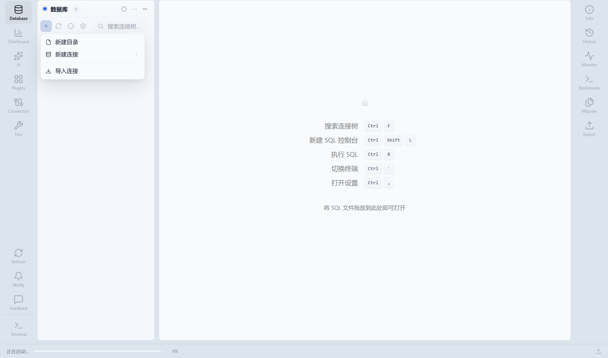

# 03 · 连接与资源树

本章说明如何接入数据库、组织资源树，以及从树上进入查询、导出、迁移与 AI 平台能力。

---

## 3.1 功能说明

资源树是工作台的主入口：管理数据源、浏览 Schema，并进入平台 AI 能力（语义层、画布、联邦、漂移等）。


**图中信息：** `Test MySQL`（带「开发」环境标签）→ 库 `demo` → 表/视图文件夹与 **AI** 目录；AI 下含分析画布、语义指标、联邦视图、Schema 漂移、数据质量、定时任务。中央叠加的是命令面板（`Ctrl+K`）。

---

## 3.2 新建数据源（完整步骤）

### 入口（任选其一）

1. 资源树顶部工具栏 → **新建数据源**（或「新建连接」）
2. 在树空白处 / 目录节点上 **右键** → **新建连接**
3. 命令面板（`Ctrl+K`）搜索「新建连接」

### 界面参照



**图中信息：** 先选数据库类型（如 MySQL），再进入表单：基本信息、连接参数、认证方式；可展开驱动下载、SSH 隧道、高级选项。底部有 **测试连接** 与保存。

### 推荐操作顺序

| 步骤 | 做什么 | 注意 |
|------|--------|------|
| 1 | 选择数据库类型 | 列表来自已安装的连接器插件；没有某类型 → 先去插件中心安装 |
| 2 | 填写显示名称 | 建议带环境前缀，如 `订单库-生产` |
| 3 | 主机 / 端口 / 库名 | 云厂商注意白名单与 SSL |
| 4 | 用户名 / 密码 | 密码可走密钥引用（见 [SECRETS.md](../SECRETS.md)） |
| 5 | （可选）驱动 | 缺 JAR 时填 Maven 坐标并下载到 `config/drivers/` |
| 6 | （可选）SSH 隧道 | 跳板机场景：填跳板主机与密钥/密码 |
| 7 | 环境标签 | 开发 / 预发 / 生产；影响危险操作提示与审批 |
| 8 | **测试连接** | 必须先测通再保存 |
| 9 | 保存 | 成功后树中出现新节点；可拖入目录分组 |

### 保存后建议立刻做的事

1. 点击连接左侧 **三角箭头** 展开（不要双击库节点——双击会开 SQL 编辑器）。
2. 展开到表，确认元数据能拉下来。
3. 右键连接 → **编辑连接**，核对环境标签是否正确。

---

## 3.3 资源树工具栏

| 按钮 / 操作 | 作用 | 常用场景 |
|-------------|------|----------|
| 新建数据源 | 打开连接表单 | 接入新库 |
| 新建子目录 | 创建分组文件夹 | 按团队 / 环境整理 |
| 导入连接 | 从文件导入连接配置 | 团队批量分发 |
| 刷新 | 重载当前树 | 刚改完 Schema |
| 定位 | 高亮当前 Tab 对应节点 | 多 Tab 时找对象 |
| 设置（树内） | 注释显示、AI 菜单显隐等 | 精简树外观 |
| 搜索框 | 过滤树节点 | 或用 `Ctrl+F` |

---

## 3.4 树层级与展开规则

### 典型层级

```text
目录（可选）
 └─ 连接（带环境标签）
     └─ 数据库 / Schema
         ├─ 表
         ├─ 视图
         ├─ 函数 / 过程（视数据源）
         ├─ SQL 文件 / 视图模型（若启用）
         └─ AI
             ├─ 分析画布
             ├─ 语义指标
             ├─ 联邦视图
             ├─ Schema 漂移
             ├─ 数据质量
             └─ 定时任务
```

### 点击行为（务必记住）

| 操作 | 连接节点 | 数据库节点 | 表节点 | AI 子项 |
|------|----------|------------|--------|---------|
| 单击左侧三角 | 展开/折叠 | 展开/折叠 | — | — |
| 双击 | 视实现连接 | **打开 SQL 编辑器** | **打开表数据页** | 打开对应平台 Tab |
| 右键 | 连接菜单 | 库级菜单 | 表级菜单 | — |

**重要：** 想展开数据库下的表，请点 **左侧箭头**，不要双击数据库名。

---

## 3.5 右键菜单速查

以下名称与界面中文一致（`explorer.context.*`）。

### 连接节点

| 菜单 | 用途 |
|------|------|
| 连接 / 断开连接 / 断开/重新连接 | 管理会话 |
| 编辑连接 | 改主机、密码、SSH、环境标签 |
| 新建数据库 / 新建 Schema | 需 DDL 权限；无所有者的旧连接可能被拒绝 |
| 移动到 | 拖到其他目录 |
| 刷新 | 刷新该连接下元数据 |
| 删除连接 | 不可恢复，仅删客户端配置不删库 |

### 数据库 / Schema 节点

| 菜单 | 用途 |
|------|------|
| SQL 编辑器 / SQL 控制台 / 新建 SQL 编辑器 | 打开查询（第 4 章） |
| 运行 SQL 文件 / 打开 SQL 文件 | 执行或编辑脚本 |
| 定时执行… | 把脚本挂到定时任务 |
| ER 图 | 打开关系图与正向建模（第 5 章） |
| 查看所有表 | 表清单 + AI 打标入口 |
| 导出 SQL / 导出向导… | 结构或结构+数据 |
| 备份向导… / 还原向导… | 备份与还原 |
| 元数据文档 | 生成注释汇总 |
| Schema 对比 | 与另一环境比结构（第 9 章） |
| 跨环境抽样对比 | 数据层抽查 |
| 数据迁移向导… | 结构/数据迁移（第 9 章） |
| 删除数据库 | 危险操作，需确认 |

### 表节点

| 菜单 | 用途 |
|------|------|
| 打开表 | 数据浏览/编辑 Tab |
| 查询控制台 | 针对该表上下文开控制台 |
| 收藏 / 固定 / 置顶 | 常用表快速访问 |
| 复制名称 / 查看 DDL / 查看属性 | 元数据 |
| 复制表 → 仅结构 / 结构+数据 | 同库或跨目标复制（视向导） |
| 导入数据 / 导出数据 | CSV 等（第 5 章） |
| 导出 SQL | 单表导出 |
| 清空表 / 删除表 | 危险；生产可能触发审批 |
| 发布到 Kafka… / 表数据发布… | 需 Kafka 相关能力 |

### AI 文件夹下

单击某一项（如 **联邦视图**）→ 打开对应平台目录 Tab（第 8 章）。无需右键。

---

## 3.6 连接生命周期

| 状态 | 表现 | 你该怎么做 |
|------|------|------------|
| 已连接 | 可展开元数据、执行 SQL | 正常使用 |
| 已断开 | 树可能灰显或提示断开 | 右键 **连接** |
| 空闲超时 | 执行时报连接失效 | **断开/重新连接** |
| 认证失败 | 测试/展开失败 | 编辑连接检查密码与密钥引用 |

---

## 3.7 用命令面板找对象

1. `Ctrl+K` 打开命令面板（截图见 `02-explorer.png` 叠加层）。
2. 输入表名、模块名（如「联邦」「仪表盘」「设置」）。
3. 回车跳转；也可搜书签、近期编辑器。

另：命令面板可打开 **组织数据目录**（分面搜索表 / 视图 / 指标，可跳转血缘），适合跨连接找对象。

---

## 3.8 非 JDBC 工作台（Redis / Kafka / YARN / SSH）

先在 **插件中心** 启用对应 Explorer 插件（如 Redis / Kafka / YARN），再 **新建数据源** 选择该类型。树节点交互与 JDBC 一致：右键菜单 + 双击/单击打开 Tab。

### 3.8.1 Redis

**建连要点（连接表单）：**

| 字段 | 说明 |
|------|------|
| 主机 / 端口 | 默认 `6379` |
| DB 索引 | 逻辑库编号，默认 `0` |
| 用户名 | Redis 6+ ACL，可留空 |
| 密码 | `requirepass`；无认证可留空 |

**入口：**

| 菜单 / 节点 | 作用 |
|-------------|------|
| **Key 浏览** / 打开 Key 浏览器 | SCAN 列 Key、分组、打开详情 |
| **命令控制台** / Redis 控制台 | 工作台：左侧 Key + 右侧详情 + 命令行 |
| 右键 Key → 查看 Key | 单 Key 详情 Tab |

**Key 浏览怎么用：**

1. 打开 Key 浏览器或 Redis 工作台。
2. 在模式框输入前缀（如 `user` 会自动变成 `user*`），点 **扫描**。
3. 可用预设：`全部` / `user:*` / `cache:*` / `sys_*`。
4. 点左侧 Key → 右侧看类型、TTL、内容预览。
5. 需要更多：点 **加载更多**；本地再过滤已加载列表。
6. 可 **复制 Key**、**删除**、**新标签打开**、**执行 GET**。

**命令行：**

1. 工作台切到 **命令行**（或显示命令区）。
2. 输入如 `PING`、`GET key`、`HGETALL key`，`Enter` 执行；`↑/↓` 翻历史。
3. 顶部可 **切换** Redis 逻辑库（DB0–DB15）。

生产环境优先用 `SCAN`，避免 `KEYS *`。

---

### 3.8.2 Kafka

**建连要点：** Bootstrap 地址；多 broker 可在高级配置写 `bootstrap.servers=host1:9092,host2:9092`。

**入口：**

| 菜单 | 作用 |
|------|------|
| **Topic 浏览** / Kafka 工作台 | 列 Topic、预览消息、发送测试消息 |
| **消费组监控** | 看 committed offset、log end、lag |
| **表数据发布…** / **发布到 Kafka…** | 把 JDBC 表逐行发到 Topic |
| 打开 Topic | 单 Topic 消息与生产者面板 |

**浏览与预览消息：**

1. 打开 Kafka 工作台。
2. 左侧用模式过滤 Topic（如 `orders` → `orders*`），点 **列出**。
3. **单击 Topic** → 右侧 **消息预览**。
4. 可选：指定分区、勾选 **从最早偏移读取**，再 **刷新**。
5. 点某条消息看 Headers；可 **复制 Key/Value**、**填入发送区**。

**发送一条测试消息：**

1. 选中 Topic，打开底部 **发送消息**（或显示发送区）。
2. 填 Key（可选）、Value（JSON 或文本）、分区（可选=自动）。
3. 点 **发送**（常用 `Ctrl+Enter`）。
4. 成功会提示写入的 partition 与 offset。  
   说明：发送测试消息 **不会** 自动创建 Topic。

**消费组指标：**

1. 打开 **消费组监控**，或在工作台显示消费组面板。
2. 选择/输入消费组；可选填 Topic（留空看全部订阅）。
3. 查看各分区 Committed、Log End、Lag 与成员。

**表数据发布到 Kafka（完整步骤）：**

1. 表节点右键 → **发布到 Kafka…**，或从 Kafka 功能进 **表数据发布**。
2. **源表**：选源连接、库、表（需 relational 数据源）。
3. **Kafka 目标**：选已有 Kafka 连接 + Topic 名。
4. 参数：连续发送条数（默认 100，上限 10000）、每批条数、间隔 ms、可选 Key 列/分区。
5. 数据来源：**表数据**（真实行）或 **测试数据**（按表结构生成）。
6. 发送方式：单次，或勾选 **持续发送 · 需手动停止**（分批循环；点停止后等当前批发完）。
7. 阅读 **发送规则** → **开始发送**。
8. 看成功/失败条数；可持续发送时用 **停止**。

每条消息为 JSON，字段名=列名。发送中表单锁定。

---

### 3.8.3 YARN

**建连：** Resource Manager 地址（默认端口 `8088`）；HTTPS 可在高级配置 `useHttps=true`。

| 入口 | 能做什么 |
|------|----------|
| **应用列表** | 按状态/用户/队列筛选；看详情、迁移队列、终止应用 |
| **节点列表** | 节点状态、健康、内存与 vCores |
| **队列列表** | 容量调度队列；改状态/容量（需 mutable-conf） |

**应用操作示例：**

1. 打开应用列表 → **应用筛选**。
2. 点某一行看详情（内存、诊断信息等）。
3. **迁移到队列**：填全路径如 `root.default` → **迁移队列**。
4. **终止应用**：确认 + 可选写入 diagnostics 的原因。

删除队列前须先将队列设为 **STOPPED** 且无运行中应用。

---

### 3.8.4 SSH 终端

| 入口 | 场景 |
|------|------|
| SSH 连接 → **打开 SSH 终端** / **新建 SSH 终端** | 直连跳板机/主机 |
| JDBC 连接（已配隧道）→ **打开 SSH 隧道终端** | 复用连接上的跳板会话 |
| **快捷命令** | 保存常用脚本片段 |

终端内可执行运维命令；与 YARN/Kafka 等「桥接」场景见桌面/SSH 相关提示（如粘贴 `yarn logs`）。生产主机务必使用最小权限账号与密钥登录。

---

## 3.9 常见问题

| 问题 | 处理 |
|------|------|
| 看不到某数据库类型 | **插件中心** 安装并启用连接器；重启/热加载后重开新建表单 |
| 展开一直转圈 | 检查网络、驱动、账号权限；看后端日志；尝试重新连接 |
| 双击库却开了 SQL | 属预期；展开请用左侧箭头 |
| AI 文件夹没有 | 树设置里是否隐藏了 AI；连接是否支持平台能力；权限是否足够 |
| 无法新建库 | 账号缺 DDL，或连接无所有者（旧数据）——用自建连接或找管理员 |
| Redis/Kafka 类型没有 | 启用 `p-redis-explorer` / `p-kafka-explorer` 等插件后再新建连接 |
| Kafka 消息预览为空 | 勾选「从最早偏移读取」或换分区后刷新 |
| 表发布找不到 Kafka | 先创建并保存一条 Kafka 连接 |

## 下一章

→ [04 · SQL 控制台](./04-sql-console.md)
