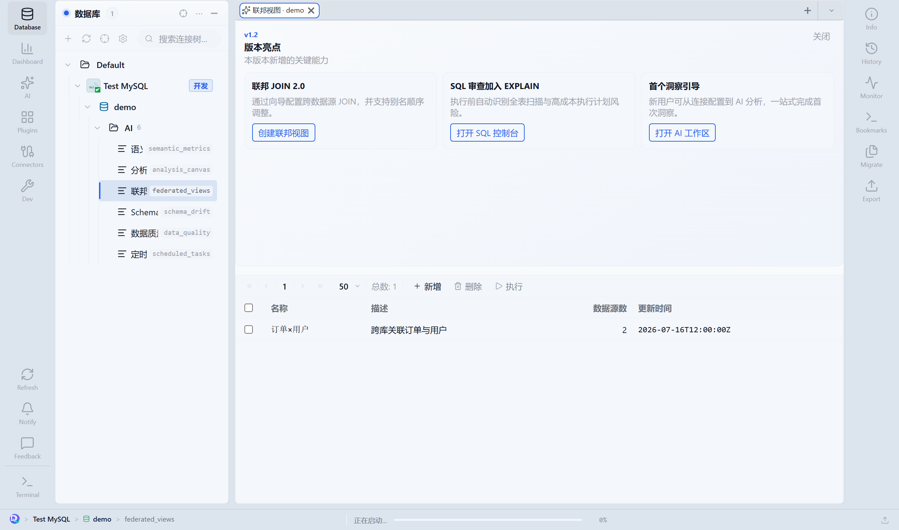

# 08 · 平台中心

平台能力挂在资源树 **连接 → 库 → AI** 下，用目录 Tab 管理画布、指标、联邦、漂移、质量与定时任务。

入口树形态见真实截图：[02-explorer.png](../assets/screenshots/02-explorer.png)。

---

## 8.1 如何进入

1. 展开目标连接与数据库（点左侧箭头）。
2. 展开 **AI** 文件夹。
3. **单击** 子项（如「分析画布」）→ 主区打开对应目录。

| 树节点 | 打开后 |
|--------|--------|
| 分析画布 | 画布列表与运行 |
| 语义指标 | 指标目录 |
| 联邦视图 | 跨源虚拟视图 |
| Schema 漂移 | 结构漂移监控 |
| 数据质量 | DQ 规则与门禁 |
| 定时任务 | Cron 任务 |

---

## 8.2 分析画布


**图中信息：** 左侧选中「分析画布」；主区列表含标题、描述、参数个数、更新时间；工具栏 **新增 / 删除 / 重新运行**。

### 从 AI 分析保存

1. 在 AI 分析跑通一次（第 6 章）。
2. 点 **保存为画布**，填写标题与描述。
3. 回到本目录，应能看到新条目。

### 重新运行

1. 选中画布 → **重新运行**。
2. 若有参数，按提示填写（如日期、区域）。
3. 查看新结果；可 **复制 SQL** 或 **打开控制台** 继续改。

### 定时

在 **定时任务** 中新建任务，类型选画布 / AI 流水线，填写 Cron，关联该画布（见 8.6）。

---

## 8.3 联邦视图（跨源 JOIN）



**图中信息：** 虚拟视图列表（名称、描述、源数量）；可走三步向导。

### 创建（三步向导）

1. **选源**：选择多个连接上的表/子查询别名。
2. **生成 SQL**：可手写或用 AI 生成；各源用 `@alias` 形式引用。
3. **保存**：写入联邦视图目录。

### 执行时注意（必读）

联邦 JOIN 在 **应用层** 完成，不是下推到数仓引擎。务必：

- 每个源子查询带过滤，控制行数；
- 注意 `maxRows` / `offset` 截断与「下一批」窗口；
- 无 `ON` 的笛卡尔积有硬上限，会被拒绝。

边界与谓词下推说明：[FEDERATED_JOIN_BOUNDS.md](../FEDERATED_JOIN_BOUNDS.md)。

### 推荐用法

```text
各源 SQL 先 LIMIT + WHERE 收窄 → 再在联邦层 JOIN → 小结果集分析
```

---

## 8.4 Schema 漂移


**图中信息：** 监控名称、源/目标、表模式、是否启用、漂移数量、上次检查时间。

### 配置监控

1. **新增** 监控：选源连接/库与目标连接/库，表名模式（如 `order_%`）。
2. 启用开关打开。
3. **运行对比**，查看漂移数量。

### 发现差异后

1. 打开报告看表/列级差异。
2. 点 **打开迁移向导**（第 9 章）修复。
3. 修复后再跑一次监控，确认数量归零。

可与定时任务结合，周期性巡检。

---

## 8.5 语义指标

1. 打开 **语义指标** 目录。
2. **新增** 或使用自动生成后人工审阅。
3. 填写：名称、表达式、单位、标签、上游依赖。
4. 保存后可在数据目录 / AI 场景中被引用（视集成深度）。

建议指标命名带业务域前缀，避免 `gmv` 这类无上下文简称。

---

## 8.6 定时任务

1. 打开 **定时任务**。
2. **新增**：名称、Cron 表达式、任务类型。
3. 类型示例：
   - 跑 SQL 文件 / 脚本
   - 重跑分析画布
   - 数据质量检查
   - 洞察摘要（insight digest，若启用）
4. 保存并确认启用。
5. 在列表查看上次运行状态；失败时点进日志。

Cron 建议先用「每小时」在开发环境验证，再改成业务节奏。

---

## 8.7 数据质量（DQ）

1. 打开 **数据质量**。
2. 新建规则：只读 SQL + 断言（行数、阈值、阈值范围等）。
3. 手工运行验证。
4. 挂到发版 / 多环境 **门禁**（由团队策略决定是否阻断发布）。

DQ SQL 应为只读；写操作不应出现在规则中。

---

## 8.8 平台能力协作关系

```text
AI 分析 ──保存──► 分析画布 ──挂载──► 定时任务
                      │
语义指标 ◄── 数据目录 / 分析引用
联邦视图 ──跨源查询──► 控制台 / 画布
Schema 漂移 ──差异──► 迁移向导 ──修复后再巡检
数据质量 ──门禁──► 发布 / 迁移前检查
```

## 下一章

→ [09 · Schema 对比与迁移](./09-schema-migration.md)
