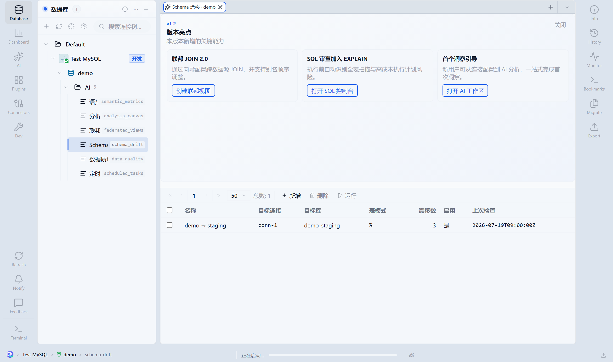

# 09 · Schema 对比与迁移

本章说明如何对比两套环境的表结构、用迁移向导同步结构/数据，以及与漂移监控闭环配合。

---

## 9.1 功能说明

用于开发 → 预发 → 生产的结构对齐、漂移修复，以及带预检的数据同步（含主键增量）。支持进度查看与暂停/取消（在支持点生效）。

---

## 9.2 Schema 对比

### 入口

| 入口 | 路径 |
|------|------|
| 资源树 | 库节点右键 → **Schema 对比** |
| 命令面板 | `Ctrl+K` 搜「Schema 对比」 |
| 漂移报告 | 发现差异后的上下文入口 |
| 工作区工具 | 右侧/工具栏 Schema 对比（若已启用） |

### 操作步骤

1. 选择 **源**：连接 + 数据库。
2. 选择 **目标**：连接 + 数据库。
3. （可选）填写表名过滤，缩小范围。
4. 执行对比。
5. 浏览表级结果：仅源有 / 仅目标有 / 双方都有但列不一致等。
6. （可选）使用 **AI 迁移建议**：根据差异摘要生成说明或脚本草稿 → **必须人工审阅** 后再用。

对比是只读分析；真正改目标库请走迁移向导。

---

## 9.3 数据迁移向导

### 入口

| 入口 | 路径 |
|------|------|
| 资源树 | 库/表右键 → **数据迁移向导…** |
| 漂移 | 报告中 **打开迁移向导** |
| 其他 | 工作区迁移快捷入口 |

### 逐步操作

#### 步骤 A：确认源

1. 选择源连接、数据库。
2. 勾选要迁移的表（可多选）。
3. 确认行数预估是否可接受。

#### 步骤 B：确认目标

1. 选择目标连接、数据库。
2. **看清环境标签**（生产会有更强确认）。
3. 确认目标账号有足够 DDL/DML 权限。

#### 步骤 C：迁移选项

| 选项 | 说明 |
|------|------|
| 仅结构 | 建表/改表，不搬数据 |
| 结构 + 数据 | 结构后再导数据 |
| 主键增量（PK_UPSERT） | 按主键写入/更新，适合目标已有数据 |
| 冲突策略 | 遇主键冲突时跳过 / 覆盖等（以向导选项为准） |
| 批次大小 | 控制单批行数，降低长事务风险 |

#### 步骤 D：预检

仔细阅读警告，例如：

- 类型不兼容
- 目标缺主键（增量无法可靠工作）
- 行数过大
- 会执行 `DROP`/`DELETE` 类高危语句

有阻断级错误时先解决再继续。

#### 步骤 E：执行与监控

1. 开始迁移。
2. 观察每表进度与已写入行数。
3. 需要时 **暂停** / **取消**（已写入部分是否回滚取决于引擎与实现，以界面提示为准）。
4. 结束后查看成功表数、失败原因、行数校验。

---

## 9.4 跨环境抽样对比

库节点右键 → **跨环境抽样对比**：

1. 选两个环境的对应表。
2. 配置抽样方式与对齐键。
3. 查看差异样本。

用于发布后抽查，**不是**全量数据同步。

---

## 9.5 与漂移监控的闭环



**图中信息：** 漂移列表中的数量与上次检查；有差异时打开迁移向导。

```text
配置漂移监控（第 8.4）
    → 定时或手工运行
    → 数量 > 0：打开报告
    → 打开迁移向导 → 预检 → 执行
    → 再跑监控，确认清零
```

---

## 9.6 生产环境检查清单

- [ ] 目标环境标签确认为预期
- [ ] 已在预发用同一向导演练成功
- [ ] 大表使用增量 + 合理批次，避开高峰
- [ ] 迁移前已做备份（第 5.6 备份向导）
- [ ] 审批策略已通过（若启用）
- [ ] 迁移后跑漂移监控与关键 DQ 规则

---

## 9.7 常见问题

| 现象 | 处理 |
|------|------|
| 预检失败：缺主键 | 仅结构迁移，或先补主键再增量 |
| 部分表成功部分失败 | 看失败详情；修好后对失败表重跑 |
| 取消后数据一半写入 | 预期可能；用备份还原或补偿脚本 |
| 对比很慢 | 加表名过滤；避开超多表的整库无过滤对比 |

## 下一章

→ [10 · 团队与治理](./10-team-governance.md)
