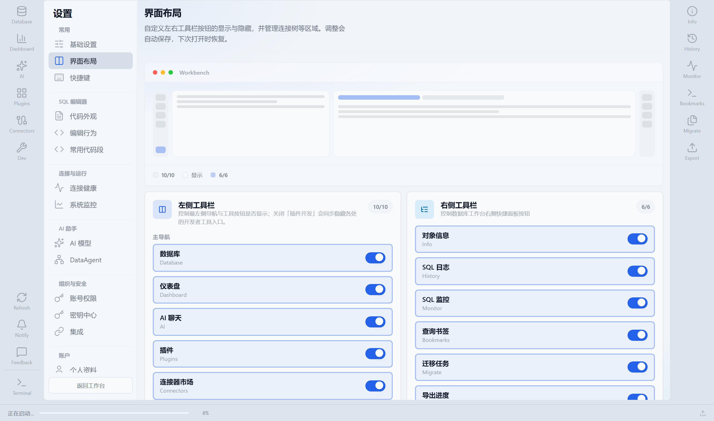

# 11 · 设置与插件

用设置调整个人偏好、连接健康、AI、组织安全；用插件中心扩展数据库类型与能力。

---

## 11.1 打开设置

| 方式 | 操作 |
|------|------|
| 快捷键 | **`Ctrl+,`** |
| 菜单 | 应用菜单 / 头像菜单 → 设置 |
| 命令面板 | `Ctrl+K` 搜「设置」 |

**图中信息：** 左侧为分组导航（常用 / 编辑器 / 连接 / AI / 组织安全 / 账户等）；右侧为当前分区卡片。底部可 **返回工作台**。管理员才看得到「组织与安全」下的账号权限、密钥中心、集成等。

### 建议浏览顺序

1. **基础设置**：API 地址、界面款式  
2. **界面布局**：显隐侧栏  
3. **AI 模型**：要用 AI 必配  
4. **连接健康**：团队环境建议打开告警  
5. （管理员）账号权限 / 集成 / 密钥中心  

---

## 11.2 基础设置

在 `06-settings-basic.png` 对应页：

| 项 | 作用 |
|----|------|
| API 服务器 | 前端请求的后端地址；联调错误时优先检查 |
| 界面款式 / 主题 | 视觉主题 |
| 语言等 | 以界面实际项为准 |

改 API 地址后若页面异常，确认后端已在对应端口启动（第 1 章）。

---

## 11.3 界面布局

**图中信息：** 开关控制导航栏、工具栏、右侧栏等；带工作台预览。与桌面顶栏「配置」里的布局快捷开关一致。

**怎么用：** 关掉不需要的右侧工具图标，主区更宽；演示时可只留资源树 + 编辑器。

---

## 11.4 连接健康

**图中信息：** 告警总开关、探测间隔（1 / 5 / 15 / 30 分钟）、状态跃迁告警、监视连接列表。

### 推荐配置

1. 打开告警开关。  
2. 生产连接加入监视列表。  
3. 探测间隔：生产 5 分钟，开发 15–30 分钟即可。  
4. 开启状态跃迁告警（健康→异常时通知）。  
5. 到仪表盘「连接状态」确认展示一致。  

通知出现在通知抽屉（第 2.7 节）。

---

## 11.5 AI 模型与 DataAgent

**图中信息：** Provider、API Key、默认模型；是 AI 聊天与分析画布的前提。另有 **DataAgent** 分区配置分析流水线行为。

### 配置步骤

1. 选择 Provider（OpenAI 兼容、Anthropic、本地 Ollama 等，以列表为准）。  
2. 填入 API Key（或密钥引用，见 SECRETS）。  
3. 选择/填写默认模型名。  
4. 保存后打开 AI 分析试问一句「你好」或简单计数 SQL。  
5. （可选）调整 DataAgent：超时、步骤开关等。  

失败时区分：Key 无效、模型名错误、网络代理、租户配额用尽（第 6.7）。

---

## 11.6 其他常用分区

| 分区 | 你能做什么 |
|------|------------|
| 快捷键 | 点击绑定区录制新组合键 |
| 代码外观 / 编辑行为 / 常用代码段 | SQL 字体、缩进、补全片段 |
| 系统监控 | 查看运行指标 |
| 个人资料 / 关于 | 账户信息与版本号 |
| 密钥中心 | 主密钥来源与外部 Secret 引用 → [SECRETS.md](../SECRETS.md) |
| 集成 | Webhook、OIDC、飞书钉钉、邮件网关（第 10 章） |
| 账号权限 | 功能级授权（第 10.6） |
| 租户管理 | 仅 multi 模式（第 10.7） |

---

## 11.7 插件中心

**图中信息：** 插件卡片（名称、版本、分类）；可搜索、启用/停用；可进入连接器市场与开发者工具（若显示 Dev）。

### 启用一个功能插件

1. 左侧进 **插件**（或设置相关入口）。  
2. 搜索插件名（如导出、Explorer 增强）。  
3. 打开 **启用** 开关。  
4. 按提示刷新工作台或重载。  
5. 回到资源树/控制台确认菜单出现。  

### 安装数据库连接器

1. 进入连接器市场 / 插件中安装对应数据库连接器。  
2. 等待安装或热加载完成；注意升级徽章。  
3. **新建数据源** 时类型列表应出现该库。  
4. JAR/驱动仍按 [config/README.md](../../config/README.md) 放到 `config/plugins/`、`config/drivers/`（视安装方式而定）。  

未启用 Explorer 相关插件时，部分树能力或类型可能不可见。

---

## 11.8 设置改完仍不生效？

| 情况 | 处理 |
|------|------|
| AI 仍不可用 | 确认保存成功；看浏览器网络是否 401；查配额 |
| 布局没变 | 返回工作台强制刷新；检查是否被桌面「配置」覆盖 |
| 新连接器没有 | 插件是否启用；是否需热加载/重启后端 |
| 权限项灰掉 | 当前账号不是管理员 |

## 下一章

→ [12 · 桌面与生态](./12-desktop-ecosystem.md)
